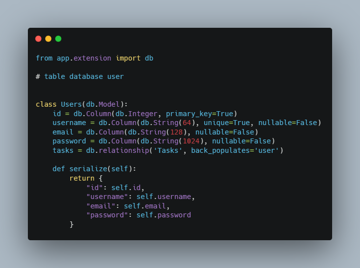
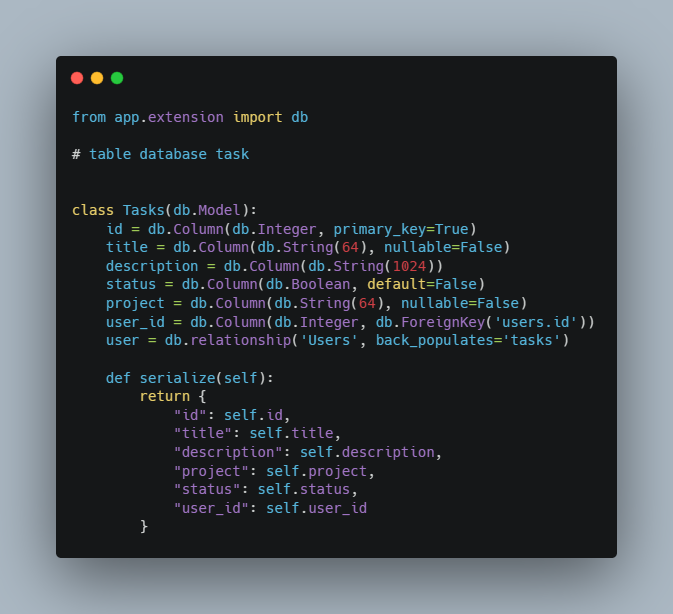
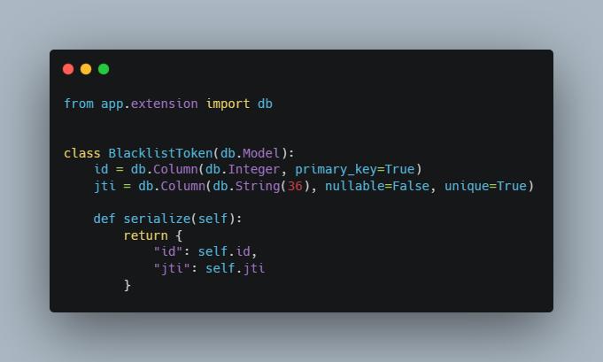
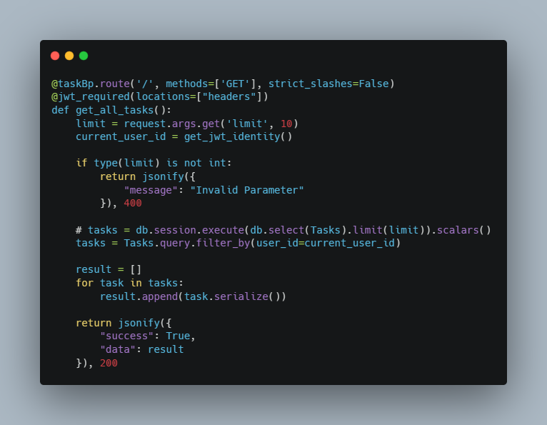
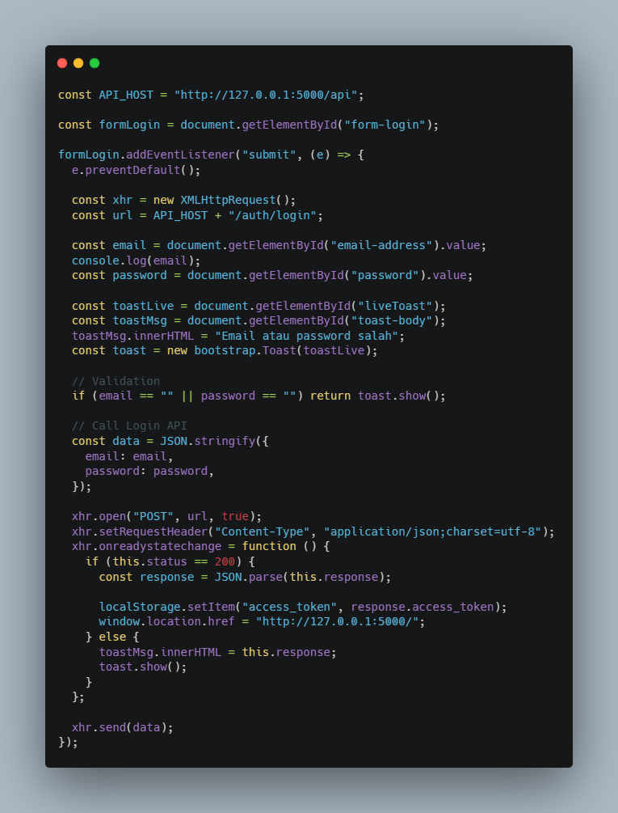
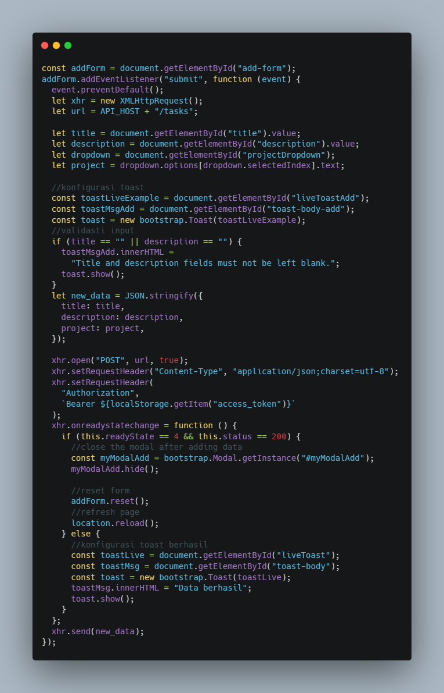

# ToDoFeast Todo Apps

## Introduction

Welcome to the project documentation for ToDoFeast Todo Apps. This documentation provides an overview of the code and its functionalities, specifically tailored for individuals new to web development.

ToDoFeast Todo Apps is a simple todo app project that combines frontend and backend skills for developers. It was developed to address the need for a comprehensive learning resource that enables developers to practice both frontend and backend skills. The project offers an opportunity to learn and enhance frontend skills by designing website layouts and implementing basic HTML and CSS code. Additionally, it provides an avenue for practicing backend skills by utilizing Python and Flask as the web framework. Through this documentation, you will gain insights into the various features and tools incorporated in the code, allowing you to learn and understand different programming concepts and functionalities.

## Requirements

Frontend:
- HTML
- CSS
- Bootstrap framework
- JavaScript

Backend:
- Python
- Flask
  - Flask SQLAlchemy
  - Flask Migrate
  - Flask JWT Extended

## Objective

The main objectives of this project are:
- Creating a web page using HTML, CSS, Bootstrap, and JavaScript
- Designing the ERD Database
- Designing Backend APIs using Python and Flask
- Frontend and Backend Integration

## Project Functionality

1. Card Drag and Drop

   

   This code consists of three functions that enable drag-and-drop functionality. If the drop container is "done-item", additional logic would be expected to update the status and perform a line-through style change in this card's attributes.

2. Database Design

   
   
   

3. Migrating Database Using Flask

   After setting up the database with the required tables and schema, the migration process can be initiated to convert the database and code into a script using Flask-Migrate. This facilitates the systematic management of database structure changes. By employing Flask-Migrate to migrate the database and code into a script, a consistent and up-to-date database schema can be maintained, simplifying the deployment process and ensuring synchronization with the application's codebase.

4. Creating API Routes

   

5. Integrating Login page with APIs

   

6. Integrating Homepage Buttons with corresponding APIs

   

